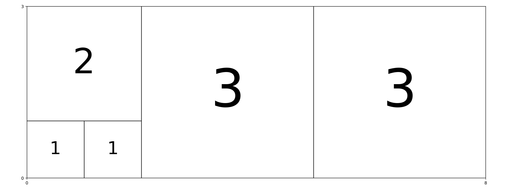

# minimal_square_tiling
長方形をいくつかの正方形で埋めたときの最小枚数の構成を求めます

# 必要ライブラリ
- matplotlib

# 実行方法
整数 $n$, $m$ について、横 $n$、縦 $m$ の長方形の正方形での最小充填を求めたいとき、

```bash
$ python min_square_tiling.py <n> <m>
```

を実行する。ターミナルに正方形の最小枚数と分割構成の木が辞書形式で表される。また分割画像が `fig/` 以下に保存される。

__分割木の構成__

```
divide: (str) ... 長方形の分割方向
    - "Long"  : 長辺側
    - "Short" : 短辺側
    - "Self"  : 分割なし
pos: (int) ... 分割位置
rect1, rect2 : (dict) ... 分割した長方形のそれぞれの分割木
size : (tuple) ... 長方形の横と縦の長さ
```

## 実行結果例

$n = 8 $、$m = 3$ の場合の実行例

**実行コマンド**

```bash
$ python min_square_tiling.py 8 3
```

**実行結果（最小枚数）**

```
横8 × 縦3 の長方形を埋めるのに必要な正方形の最小数: 5
```

**実行結果（分割構成）**

```
{'divide': 'Long',
 'pos': 2,
 'rect1': {'divide': 'Long',
           'pos': 1,
           'rect1': {'divide': 'Long',
                     'pos': 1,
                     'rect1': {'divide': 'Self',
                               'pos': None,
                               'rect1': None,
                               'rect2': None,
                               'size': (1, 1)},
                     'rect2': {'divide': 'Self',
                               'pos': None,
                               'rect1': None,
                               'rect2': None,
                               'size': (1, 1)},
                     'size': (2, 1)},
           'rect2': {'divide': 'Self',
                     'pos': None,
                     'rect1': None,
                     'rect2': None,
                     'size': (2, 2)},
           'size': (2, 3)},
 'rect2': {'divide': 'Long',
           'pos': 3,
           'rect1': {'divide': 'Self',
                     'pos': None,
                     'rect1': None,
                     'rect2': None,
                     'size': (3, 3)},
           'rect2': {'divide': 'Self',
                     'pos': None,
                     'rect1': None,
                     'rect2': None,
                     'size': (3, 3)},
           'size': (6, 3)},
 'size': (8, 3)}
```

**分割画像**




